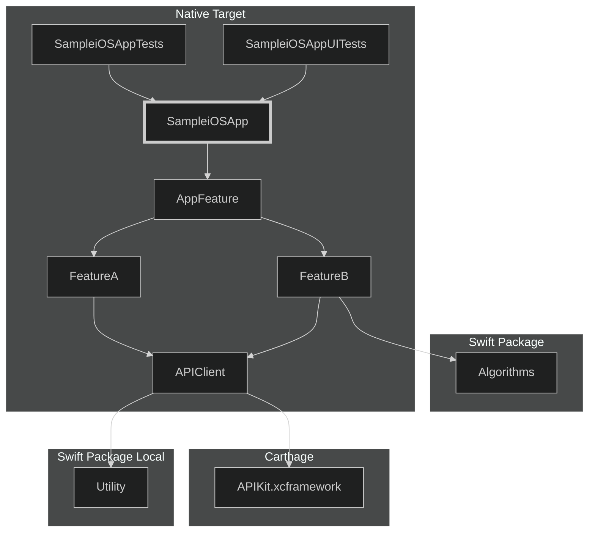

# XcodeTargetGraphGen


XcodeTargetGraphGen is a Swift command-line tool that interprets `.xcodeproj` files to create a visual depiction of module-level internal dependencies using Mermaid diagram syntax. By supporting multiple package managers, it enables users to visually map out the structure and dependencies of Xcode projects across various environments, providing a clear and comprehensible graphical representation of these relationships.

The supported package managers are as follows:

- Swift Package Manager
- Carthage
- CocoaPods (only supports the old format that does not use [.xcfilelist](https://blog.cocoapods.org/CocoaPods-1.7.0-beta/))

# Installing

## Swift Package Manager

### Use as CLI

```bash
git clone https://github.com/CuriositySoftware/XcodeTargetGraphGen.git
cd XcodeTargetGraphGen
swift run xcgraphgen [project-file-path]
```

# Usage

Simply run:

```bash
xcgraphgen [project-file-path] [OPTIONS...] 
```

```
$ xcgraphgen -h
OVERVIEW: Output Xcode Target Dependency Graph.

USAGE: xcgraphgen [<options>] <project-file-path>

ARGUMENTS:
  <project-file-path>     .xcodeproj file path.

OPTIONS:
  --output-file-path <output-file-path>
                          Output file path. (default: ./dependencies.md)
  --mermaid-theme <mermaid-theme>
                          Select Mermaid theme type (eg: neutral, forest, dark, base). (default: dark)
  --mermaid-syntax-type <mermaid-syntax-type>
                          Select Mermaid syntax type. (default: flowchart)
  --mermaid-chart-direction <mermaid-chart-direction>
                          Select Mermaid graph/flowchart direction. (default: TD)
  --enable-swift-package-output/--disable-swift-package-output
                          Targeting Swift Package Product for output. (default: --disable-swift-package-output)
  --enable-apple-sdk-output/--disable-apple-sdk-output
                          Targeting Apple SDKs for output. (default: --disable-apple-sdk-output)
  --enable-carthage-output/--disable-carthage-output
                          Targeting Carthage for output. (default: --enable-carthage-output)
  --enable-cocoa-pods-output/--disable-cocoa-pods-output
                          Targeting CocoaPods SDKs for output (only old format without .xcfilelist). (default: --enable-cocoa-pods-output)
  --enable-vendor-output/--disable-vendor-output
                          Targeting vendor project for output. (default: --disable-vendor-output)
  --dry-run               Output to console without file output
  --version               Show the version.
  -h, --help              Show help information.
```

# Examples

```bash
swift run -c release xcgraphgen ./SampleiOSApp/SampleiOSApp.xcodeproj/
```



# Other libraries

The Swift and iOS communities have other tools for Xcode that have different priorities and tradeoffs than XcodeTargetGraphGen.

- [swift-dependencies-graph](https://github.com/Ryu0118/swift-dependencies-graph)
